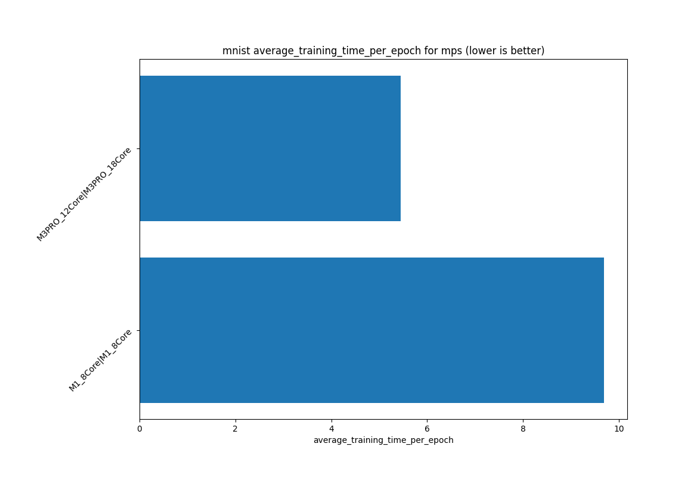

# ai-benchmark-suite

## run 
preperations
```bash
poetry install  # install dependencies
poetry shell  # activate virtual environment
```

first you need to generate your device information file to gather information about your device
```bash
python -m src.ai_benchmark_suite.device_information
```

then you can run the benchmark suite
```bash
python -m src.ai_benchmark_suite
```

## results

### MNIST


